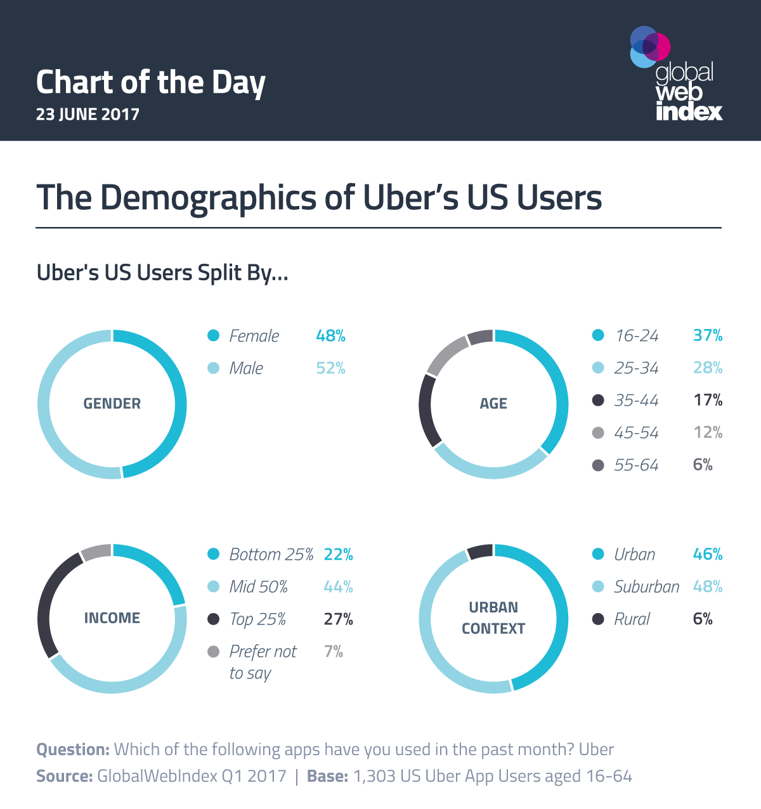

# Socio-historical Context and Impact Report

## Socio-historical Context

Concerning Uber prices and covid cases, there exist many societal factors that must be taken into account when considering the data. A policy that has a significant effect on our data is the stay-at-home order which was first mandated during the start of the pandemic. After the initial flurry of individuals finding their way home, many cities, including Chicago, had a stay-at-home order which prevented individuals from leaving their homes unless it was for something essential. As stated on *Ballotpedia* the ban in Chicago was going on until May 29 (Documenting Illinois). The order was lifted along with the rest of Illinois. This period will have affected the number of Uber rides and prices. With the stay-at-home order, the number of Uber rides and drivers will have significantly decreased. This will have affected the price in two ways. First, due to the stay-at-home order, the number of drivers may be significantly less than riders, driving up the prices. The other case is a lack of riders and too many drivers, which will drive down the cost. Given either scenario, the policy of a state at home order (which has a direct relation to the number of covid cases) affects the Uber prices, which is something we must consider when looking at our data. Given that the stay-at-home order reduced the number of cases by “30.2 percent in week 1, 40.0 percent in week 2, and 48.6 percent in week 3” (Fowler), the drivers/riders may have become more comfortable with the conditions over time. This will affect the number of drivers and users which will affect the price during that period.  

Another such factor is the mask mandate. We will focus on Chicago since the data is from this particular city, however, this has affected other regions throughout the United States. The mask mandate was initially favored, but over time, became less and less popular with large parts of the population. The mask mandate may have deterred certain individuals from using Uber due to their refusal to wear masks. Uber, for a while, maintained a mask requirement, which near the end of the pandemic,  became unpopular with an increasing number of people.  In an NYT article, a track and field coach was interviewed, who stated that " ‘I’m tired of it, OK ’ ", with regards to masks. To further emphasize her point she explained, " ‘I’ve already had Covid. I’ve already been vaccinated. It doesn’t make sense’ "(Healy and Smith). Although the number of individuals who boycotted Uber may be small, it is still a policy that will have affected the data in our dataset. 

### Stakeholders:
Our project topic affects the general population since all individuals are affected by the covid pandemic. More specifically, this topic engages individuals who rely on rideshare apps as a method of transportation. This topic also involves the rideshare companies themselves, since they are providing the service. This includes those who work at the company (corporate) and those who work for Uber (drivers). Individuals who use Uber may be hurt by our findings since the companies may find that the demand is still there even during a pandemic and may increase the base price to increase profits.  Many users do not have other options other than utilizing rideshare (e.g. they may be uncomfortable with public transport) and they may have to suffer the consequences of increased prices. Uber as a company may benefit from this information since it can optimize prices to ensure maximum profits. Covid has thrown a lot of companies off, and with this data, Uber can find the best prices as the number of covid cases change over time. This will benefit the company as a whole. 

### Relevant Technical or Non-Technical Research

A research paper provided by the *Journal of Urban Management* took a slightly different approach to the correlation between uber prices and the number of covid cases. The research studied the impact of the Covid 19 pandemic by using the emotions of the Twitter users. This study took a collection of tweets related to ridesharing and through a process of parsing data, determined the emotion of each tweet. After compiling this data, the study found that “expressions of TNC users on Twitter were inclined towards negative sentiment and emotions”(Morshed). Although there were negative reviews towards rideshare apps there also were “positive remarks of satisfaction” (Morshed) which shows that users were not entirely unhappy during the pandemic. Emotions are an important factor in many individuals’ decisions and this is the same for companies. Companies want to cater to what the public wants and will often listen to what they say. This research will help many individuals’ satisfaction, however, may put others in a disadvantaged position. If companies take social media responses seriously, only those who use Twitter (or social media in general) will have much of a say in how rideshare apps change. This means that those who do not use or have access to social media are at a disadvantage. Their voices are not heard and any changes made may harm them. Thus, rideshare companies need to consider that not everybody will have a say in these changes. They must be wary of how changes will affect people in the short term and the long term.  

### Impact of Socio-Historical Research Findings

Looking at an article by *Buildfire* we can see the ever-increasing revenue for Uber (the data is until 2018). Two years before the start of the pandemic we can see that the number of users is steadily increasing. Given this increased usage, we are intrigued by the demographic of Uber users (Uber Revenue and Usage Statistics). Looking at the visual given by *GWI’s Chart of the Day*, the demographic of uber users pre-pandemic is split evenly among certain demographic features. For our project, we want to focus on the demographic of user income since we are concerned with price. By looking at the users and their respective income, we see that the bottom 25% and top 25% of income both have roughly 25% of users, and the rest being the middle 50% of income (McGrath). This context will not affect how we frame our question however, it may change how we analyze our data. Since we are seeing how covid affects Uber prices, we can analyze in a way that sees how changing prices will affect certain demographics. We can associate a more positive or negative effect of the price change concerning covid data. The way we interpret the findings will change as well since it is no longer just about the numbers but rather the social impact of our findings. Increased prices will affect those in the lower-income category, and since the context shows that 25% of people from the lower-income category rely on Uber, a price increase may disproportionately affect individuals in this demographic.

## Ethical Considerations

### Historical or Societal Biases
The data collected with regards to rideshare rides have no social bias since all rides must be reported to the city by law. Thus there is no way for companies to not report certain rides to skew the data. On the other hand covid, data may have some biases due to the respective nature of the tests. The data only consists of PCR tests thus, positives coming from rapid tests are not reported. Rapid tests tend to be more inexpensive and these numbers are not reported for this dataset. Communities that rely more on the rapid tests will cause the community positivity rate to be underreported. Tests are counted by the Chicago Department of Public Health thus, if the CDPH does not count certain tests, the number will not be as accurate.  

### Interpetation Bias
There may be biases in regards to the period of covid cases in our data. Due to the decreased number of testing recently due to the nature of the pandemic, the number of cases may be less accurate compared to when testing was conducted more frequently. Since we must make some assumptions with regards to the frequency of testing this may bias our data. Even if there is a general decline in cases, the decline in testing will affect the data. This means that when we interpret our data, we are making some assumptions when analyzing the change in price concerning covid cases.  

### Privacy
The privacy of the rideshare companies may be affected by the analysis of our data since we are showing how they change prices concerning covid. However, since this data is publicly available, we do not see this as a significant issue. The rideshare companies also do not directly correlate (or say they do not) covid cases with their prices; this breach of privacy is very minimal and possibly non-existent.  
http://dev.cityofchicago.org/open%20data/data%20portal/2019/04/12/tnp-taxi-privacy.html
This data has been collected in a way which protects the user's identity. As explained in the link above “data about an individual’s location at certain points in time can create a “fingerprint” that can allow for re identification, as long as there is a separate dataset available containing parts of the fingerprint along with identifying fields.”. The article explains the possible privacy issues of collecting this data and offers a solution stating “datasets have been aggregated in a way that protects passenger personal privacy by avoiding reidentification,”. The file goes on to explain, the methods in which privacy is maintained. This will not be included in this document due to its length but can be referenced in the link above. 

### Misuse of Data
Since the data is publicly available through the city (ie it is public data) we are free to use the data in a way that suits our needs, I believe that the data is being used appropriately. We are not harming the privacy of the data since data has been collected in a way that each individual's privacy is protected as explained by the city of Chicago. The city of Chicago has handled the data in such a way that individuals do not get harmed when outside parties access and use the data.  

### Biases in data collection
 
This may actually eliminate bias, but it is important to note that data was not collected during holiday periods due to atypical travel patterns.  

### Misuses of our project results

Rideshare companies can use our prediction models and use it to their advantage to make a greater profit on their side. If they see that people are still using rideshare even with higher prices especially during a time of hardship such as a pandemic, they may see that as an opportunity to take advantage of the users and spike up their prices. From a user perspective if they see that rideshare prices become cheaper due to the pandemic they may be inclined to falsify information to spread fear in hopes of a cheaper ride.

## Works Cited

“Documenting Illinois' Path to Recovery from the Coronavirus (COVID-19) Pandemic, 2020-2021.” Ballotpedia, https://ballotpedia.org/Documenting_Illinois%27_path_to_recovery_from_the_coronavirus_(COVID-19)_pandemic,_2020-2021.
Fowler, James H., et al. “The Effect of Stay-at-Home Orders on Covid-19 Cases and Fatalities in the United States.” MedRxiv, Cold Spring Harbor Laboratory Press, 1 Jan. 2020, https://www.medrxiv.org/content/10.1101/2020.04.13.20063628v3#:~:text=Compared%20to%20counties%20that%20did,61.7)%20reduction%20after%20three%20weeks.
Healy, Jack, and Mitch Smith. “With Joy and Fear, Americans Watch Sweeping Mask Rules Vanish.” The New York Times, The New York Times, 20 Apr. 2022, https://www.nytimes.com/2022/04/19/us/covid-masks-planes.html.
McGrath, Felim. “The Demographics of Uber's US Users.” GWI, GlobalWebIndex Q1 2017, https://blog.gwi.com/chart-of-the-day/uber-demographics/.
Morshed, Syed Ahnaf, et al. “Impact of Covid-19 Pandemic on Ride-Hailing Services Based on Large-Scale Twitter Data Analysis.” Journal of Urban Management, Elsevier, 20 Mar. 2021, https://www.sciencedirect.com/science/article/pii/S2226585621000200.
“Uber Revenue and Usage Statistics.” BuildFire, 27 Feb. 2021, https://buildfire.com/uber-statistics/#:~:text=The%20majority%20of%20Uber%20users,users%20come%20from%20rural%20areas. 