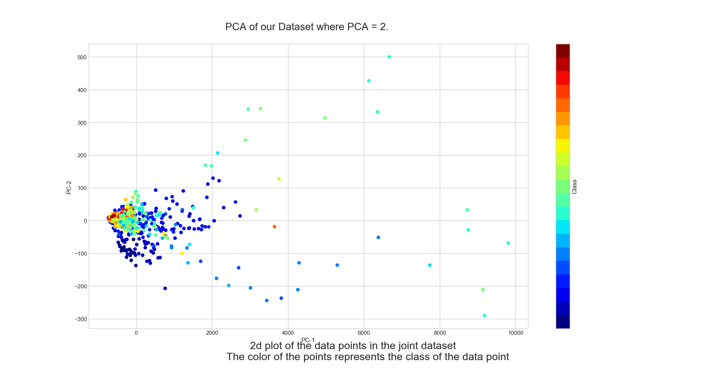
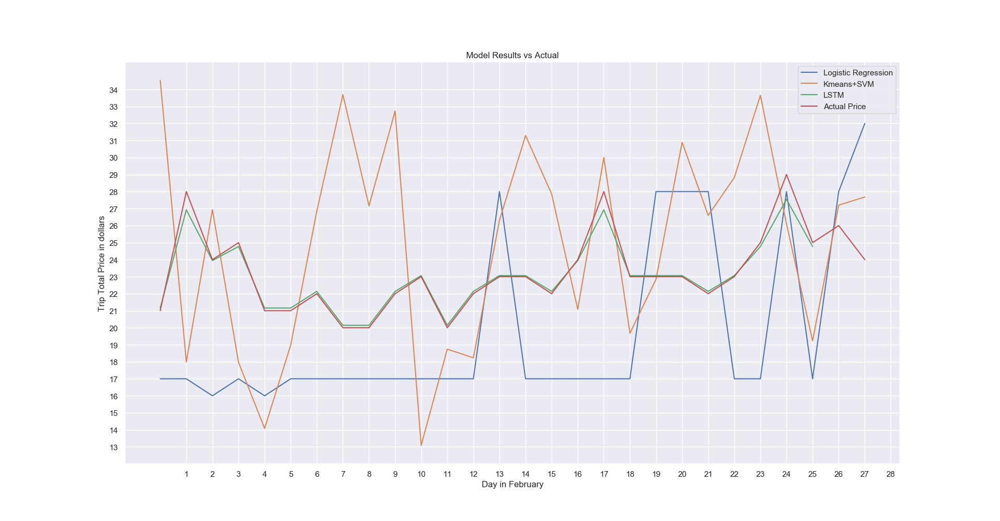

# Visualizations

## Data Visualization
- To learn the distribution of the data points in our dataset, we used principal component analysis (PCA) to reduce the dimensionality of the data. 
- The graph below is the plot with the first two principal components.

- The graph below is the plot with the first three principal components.

## Machine Learning Visualizatons
- This is the plot that shows the predictions of liner regression model against the ground truth price labels for the month of February, 2022.

- This is the plot that shows the predictions of KMeans+SVM model against the ground truth price labels for the month of February, 2022.

- To find the optimum k for KMeans, we used the elbow method. The graph below shows the elbow plot.

- From here we can see that the optimum k is 3.

- This is the plot that shows the predictions of LSTM model against the ground truth price labels for the month of February, 2022.

- This is the plot that shows the predictions of all the models against the ground truth price labels for the month of February, 2022.
